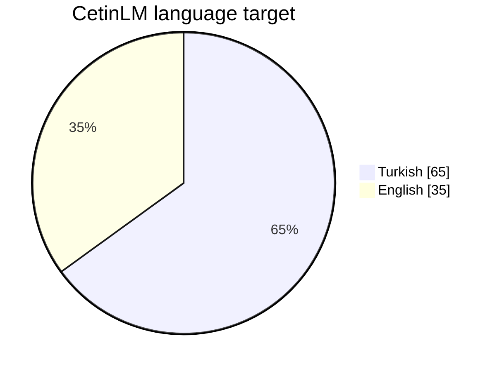

<p align="center">
  
</p>

<h1 align="center">CetinLM</h1>

<p align="center">
  <strong>From-scratch Turkish-first language model research.</strong><br>
  Better data density, verified capabilities, efficient training, measurable engineering.
</p>

<p align="center">
  
  
  
  
  
  
  
</p>

---

> **CetinLM is not a wrapper, fine-tune, or continued-pretraining experiment on someone else's model.**
>
> CetinLM is a fresh-scratch language-model research program focused on extracting more useful capability from every parameter, training token, and unit of compute.

# 2026 direction

The project has moved beyond its Phase-I foundation experiments.

The new direction is deliberately simple:

```text
less random bulk
      +
more useful information per token
      +
first-party Turkish data
      +
verified capability data
      +
fast fail-closed filtering
      =
more useful capability at ~1B scale
```

The objective is no longer to maximize corpus size for its own sake.

The objective is to build a **small-model corpus with high task density**: language, common knowledge, mathematics, science, code, technical knowledge, culture, everyday reasoning, and practical user-facing concepts should all earn their place in the training budget.

---

# CetinLM-1B

CetinLM-1B is the current research target: large enough to learn useful language-model behavior, but small enough that the full stack can still be audited, profiled, retrained, and changed experimentally.

### Reference model body

| Component | Current design |
|---|---:|
| Model class | **Decoder-only Transformer** |
| Scale | **≈1B parameters** |
| Hidden size | **1,792** |
| Transformer layers | **20** |
| Query heads | **28** |
| KV heads | **7** |
| Head dimension | **64** |
| Attention | **Grouped-Query Attention (GQA)** |
| MLP | **SwiGLU** |
| MLP intermediate size | **7,168** |
| Normalization | **Pre-RMSNorm** |
| Position encoding | **RoPE** |
| Maximum configured context | **4,096** |
| Dropout | **0.0** |
| Bias | **False** |
| Embeddings | **Tied input/output** |
| Objective | **Causal next-token prediction** |

> Exact parameter count depends on the tokenizer vocabulary selected after benchmarking.

### Architecture sketch

```text
                           CETINLM-1B

 token ids
    │
    ▼
┌──────────────────────────────┐
│       Token Embedding        │
│   candidate vocab → 1,792    │
└──────────────┬───────────────┘
               │
               ▼
┌────────────────────────────────────────────────────┐
│              20 Transformer Blocks                 │
│                                                    │
│  RMSNorm                                           │
│     ↓                                              │
│  GQA Attention                                     │
│  28 Q heads / 7 KV heads / head dim 64 / RoPE    │
│     ↓                                              │
│  Residual                                          │
│     ↓                                              │
│  RMSNorm                                           │
│     ↓                                              │
│  SwiGLU                                            │
│  1,792 → 7,168 → 1,792                             │
│     ↓                                              │
│  Residual                                          │
└─────────────────────────┬──────────────────────────┘
                          │
                          ▼
                    tied LM head
                          │
                          ▼
                   next-token logits
```

---

# Corpus strategy: useful tokens first

CetinLM now treats corpus design as a capability-allocation problem rather than a web-scale collection problem.

The current **top-level design target** is:

```text
CetinLM training corpus
│
├── Turkish 65%
│   │
│   ├── First-party curated Turkish
│   │   ├── TR Base
│   │   ├── TR Research
│   │   ├── TR Turkish Pulse
│   │   └── TR Youth Base
│   │
│   ├── Capability-focused Turkish
│   │   ├── TR Mathematics
│   │   ├── TR Code
│   │   └── TR Science
│   │
│   └── Natural Turkish
│       ├── wiki_train_tr.jsonl
│       ├── FineWiki TR
│       └── NUCLEAR-filtered FineWeb TR
│
└── English 35%
    └── High-quality English
        ├── FineWeb-Edu Dedup
        ├── English Wikipedia
        └── additional qualified high-quality EN sources
```

The **65/35 split is the current language design target**. Exact sub-source weights are not frozen yet; they will be decided from clean token counts, quality audits, duplication/diversity measurements, tokenizer efficiency, and capability coverage.



## First-party Turkish datasets

These datasets are being created specifically for CetinLM instead of being scraped blindly from the public web.

| Dataset | Purpose | Role |
|---|---|---|
| **TR Base** | Broad clean Turkish knowledge and explanatory prose | Core Turkish language + general knowledge |
| **TR Research** | Technical, scientific, official and research-oriented material | Higher-information-density Turkish |
| **TR Turkish Pulse** | Turkish culture, daily life, interests, music, trends and social context | Cultural and contemporary language coverage |
| **TR Youth Base** | Everyday life, technology, communication, finance, learning and practical topics | User-facing utility and natural modern Turkish |
| **TR Mathematics** | Mathematical concepts and worked knowledge | Mathematical foundation |
| **TR Code** | Programming, algorithms and software concepts | Code and computational capability |
| **TR Science** | Core scientific concepts and explanations | Scientific reasoning foundation |

First-party data does **not** automatically bypass quality control. It still goes through validation, deduplication, diversity checks, and corpus qualification before training.

## Natural Turkish lane

Natural data remains important because a model should not learn only synthetic writing patterns.

The Turkish natural-language lane includes:

- `wiki_train_tr.jsonl` — project-collected / prepared Turkish Wikipedia-derived natural prose,
- **FineWiki TR** — trusted natural Turkish background text,
- **NUCLEAR-filtered FineWeb TR** — web data only when it survives the project's aggressive fail-closed quality gates.

The current v61.2 trusted-first remote bootstrap keeps risky Turkish web acquisition out of the fast path. FineWeb TR is therefore treated as a **qualified/gated natural source**, not as an unconditional active dependency.

## High-quality English lane

English remains a major part of the corpus because it contributes technical knowledge, broad world knowledge, code-adjacent language, scientific terminology, and cross-lingual transfer.

Current trusted sources include:

| Source | Purpose |
|---|---|
| **FineWeb-Edu Dedup** | High-quality educational and explanatory English |
| **English Wikipedia** | Natural encyclopedic background |
| **Future qualified EN sources** | Added only after source-specific auditing |

---

# Why capability-centric data?

A 1B model has a limited parameter and token budget.

Teaching it millions of low-value fragments is not automatically better than teaching it fewer, denser examples of things users actually ask.

CetinLM therefore prioritizes capabilities such as:

| Capability | Example learning targets |
|---|---|
| **Everyday utility** | phones, PCs, storage, batteries, shopping, travel, banking, practical decisions |
| **Common knowledge** | cities, geography, dates, institutions, basic world knowledge |
| **Turkish language** | natural prose, grammar, writing variety, modern usage |
| **Turkish culture** | daily life, media, music, habits, local context |
| **Mathematics** | arithmetic, algebra, percentages, geometry, probability, quantitative reasoning |
| **Code** | programming concepts, algorithms, debugging, computational thinking |
| **Science** | physics, chemistry, biology and core scientific reasoning |
| **Technical knowledge** | hardware, networking, software, systems and practical engineering |
| **Research literacy** | careful explanation, evidence-oriented technical prose |

The guiding question for each document is increasingly:

> **What useful capability does this document teach the model?**

---

# Mathematics: knowledge + verified reasoning

Mathematics is not treated as ordinary prose.

The planned mathematics stack separates three kinds of training signal:

```text
TR Mathematics
│
├── Math Knowledge
│   └── concepts, definitions, relationships, explanations
│
├── Verified Math Reasoning
│   └── problem → steps → answer → deterministic verification
│
└── Error / Contrastive Math
    └── wrong method → why wrong → corrected solution
```

**Verified Math Reasoning** is a planned high-priority dataset family. Where possible, answers will be checked deterministically with Python / symbolic or numerical tooling rather than trusting generated prose alone.

The goal is to teach CetinLM not only to *talk about mathematics*, but to *perform mathematical transformations and solve problems*.

---

# Fast fail-closed corpus pipeline

Corpus filtering must be strict **without turning data preparation into the bottleneck**.

The current v61.2 design therefore favors cheap, early, deterministic rejection over expensive multi-stage rescoring of obviously bad sources.


### Current filtering philosophy

```text
obviously bad       → reject early
uncertain web junk  → reject
low-value tails     → reject when cheap to detect
first-party data    → validate, do not blindly trust
math/science/code   → stronger source-family checks
clean natural text  → preserve
```

The v61.2 Turkish FineWiki lane also uses a final fail-closed quality floor before accepted rows are written to the clean cache.

The important systems rule is:

> **Precision should improve without destroying throughput.**

No LLM judge is placed in the hot path of general corpus acquisition. Expensive validation is reserved for dataset families where factual correctness justifies it.

---

# Tokenizer: benchmark before freeze

The new CetinLM run does **not** inherit a Phase-I tokenizer by default.

A fresh tokenizer is trained and benchmarked from the qualified corpus.

| Candidate | Vocabulary |
|---|---:|
| Candidate A | **32,768** |
| Candidate B | **49,152** |
| Candidate C | **65,536** |

All candidates use ByteLevel BPE with a full byte alphabet and fixed special-token IDs.

The winner is selected from measured behavior, including Turkish/English token efficiency and corpus-level benchmarks, then frozen by artifact hash before large-scale preparation begins.

```text
qualified clean corpus
        ↓
32K / 48K / 65K candidates
        ↓
benchmark token efficiency
        ↓
compare practical trade-offs
        ↓
freeze winner + SHA256
        ↓
prepare training shards
```

---

# Full research stack

```text
┌──────────────────────────────────────────────────────────────┐
│                        CETINLM STACK                         │
├──────────────────────────────────────────────────────────────┤
│                                                              │
│  First-party + qualified natural data                         │
│           ↓                                                  │
│  Source-specific filtering / dedup / diversity                │
│           ↓                                                  │
│  Clean text cache + provenance                                │
│           ↓                                                  │
│  Fresh tokenizer A/B/C benchmark                              │
│           ↓                                                  │
│  Exact token accounting / train-validation shards             │
│           ↓                                                  │
│  CetinLM-1B Decoder Transformer                               │
│  GQA / RoPE / SwiGLU / tied embeddings                        │
│           ↓                                                  │
│  Fresh-scratch pretraining                                    │
│           ↓                                                  │
│  Validation / probes / target-rank diagnostics                │
│           ↓                                                  │
│  Instruction / Chat / Reasoning / Code post-training          │
│           ↓                                                  │
│  Quantization / KV cache / serving / applications             │
│                                                              │
└──────────────────────────────────────────────────────────────┘
```

---

# Measure first

CetinLM keeps the engineering loop that survived Phase-I:

```text
OBSERVE
   ↓
MEASURE
   ↓
FORM A HYPOTHESIS
   ↓
A/B TEST
   ↓
KEEP WHAT WINS
   ↓
DOCUMENT THE RESULT
```

This applies to architecture, data, tokenizer design, filtering, GPU throughput, and evaluation.

A theoretically elegant optimization is not considered an improvement until it wins on the actual system.

---

# Evaluation philosophy

CetinLM separates different questions that are often incorrectly collapsed into one metric.

```text
Does the model know it?
          ≠
Can the model reason through it?
          ≠
Can the model present it as a useful assistant?
```

Evaluation is expected to combine:

- validation loss and perplexity,
- fixed Turkish and English probes,
- next-token target-rank diagnostics,
- capability-specific evaluations,
- math / reasoning tests,
- code tests,
- controlled generation,
- repetition / degeneration checks,
- checkpoint-to-checkpoint comparisons.

A base checkpoint is not judged as if it were already a chat model.

---

# Current research roadmap

```text
                         CETINLM ROADMAP

Capability-centric corpus design
            │
            ├── TR Base / Research / Pulse / Youth
            ├── TR Math / Code / Science
            ├── Natural TR
            └── High-quality EN
            │
            ▼
v61.2 fast fail-closed qualification
            │
            ▼
Corpus-level dedup + diversity qualification
            │
            ▼
Fresh tokenizer 32K / 48K / 65K A/B/C
            │
            ▼
Freeze tokenizer + corpus contract
            │
            ▼
Fresh-scratch CetinLM-1B pretraining
            │
            ▼
Base-model evaluation
            │
            ├── language
            ├── common knowledge
            ├── math / reasoning
            ├── science
            ├── code
            └── technical / everyday utility
            │
            ▼
Instruction / Chat post-training
            │
            ▼
Reasoning + Code specialization
            │
            ▼
Inference engineering / quantization / serving
```

Final corpus size, exact sub-source ratios, tokenizer vocabulary, and training-token budget are intentionally **not frozen before measurement**.

---

# Phase-I archive

Phase-I was valuable because it exposed real problems in tokenizer design, data quality, training geometry, evaluation, and small-model behavior.

It is now historical research rather than the active training recipe.

Older GitHub development documents are preserved under:

```text
docs/history/github/phase1/
```

They are retained for reproducibility and engineering history, but should not be interpreted as the current CetinLM corpus or training plan.

---

# Research / developer logs

Major design changes, experiments, corpus audits, negative results, and roadmap updates are published as dated development logs rather than continuously bloating the project front page.

Current documentation structure:

```text
docs/history/github/
├── README.md                 ← current public project overview
├── CETINLM_DEVELOPER_LOG_*.md
└── phase1/                   ← historical Phase-I documents
```

---

# Hardware philosophy

The development platform intentionally makes inefficiency visible.

| Hardware | Current development platform |
|---|---|
| GPU | **NVIDIA RTX 4070 Ti SUPER** |
| VRAM | **16 GB** |
| System RAM | **64 GB** |

Accessible hardware is a research constraint, not the long-term identity of the model family.

The goal is to learn which engineering decisions actually improve capability-per-compute before larger scale hides inefficiency behind more hardware.

---

# Data sources and provenance

CetinLM combines project-created first-party datasets with qualified third-party natural-language sources.

Third-party content remains subject to its original licenses, terms, copyright, privacy, and other applicable rights. CetinLM does not claim ownership of upstream third-party content.

Current / planned qualified natural-source families include:

- FineWeb-Edu Dedup,
- English Wikipedia,
- FineWiki TR,
- Turkish Wikipedia-derived project data,
- NUCLEAR-filtered Turkish web data when it passes the active source contract.

First-party CetinLM datasets are tracked separately with source-family identity and provenance so that synthetic / curated data is not silently mixed with natural web text.

Release-specific provenance and licensing information will accompany public artifacts where applicable.

Nothing in this repository constitutes legal advice.

---

---

# Model family

CetinLM is designed to evolve as a **model family**, not as one overloaded checkpoint.

The current fresh-scratch corpus program builds the shared capability foundation first. The same data program also prepares clean, source-aware material that can later be transformed or specialized for the appropriate post-training stage.

```text
CetinLM-1B-Base
       │
       ├── CetinLM-1B-Instruct
       │
       ├── CetinLM-1B-Chat
       │
       ├── CetinLM-1B-Reasoning
       │
       └── CetinLM-1B-Code
```

| Planned model | Primary role | Data direction |
|---|---|---|
| **CetinLM-1B-Base** | General pretrained foundation | High-quality TR/EN language, knowledge, mathematics, code, science, technical and everyday utility |
| **CetinLM-1B-Instruct** | Instruction following and task completion | Instruction/task transformations built on the qualified capability corpus |
| **CetinLM-1B-Chat** | Natural assistant behavior and conversation | Dialogue, conversational Turkish/English, assistant behavior and later preference-oriented data |
| **CetinLM-1B-Reasoning** | Structured problem solving | Verified Math Reasoning, quantitative reasoning, error correction and other validated reasoning material |
| **CetinLM-1B-Code** | Programming specialization | Code, algorithms, debugging, explanation and code-reasoning data |

This is why the current dataset work is broader than ordinary web pretraining. **TR Mathematics, TR Code, TR Science, Technical, Everyday Utility and the first-party Turkish families are being engineered both to strengthen the Base model and to provide clean foundations for later family specialization.**

The stages are intentionally separated: Base pretraining teaches broad representations and capabilities; Instruct, Chat, Reasoning and Code checkpoints specialize behavior without forcing every objective into a single set of weights.

> **One foundation. Multiple capability-focused descendants.**

---

# Project links

| Resource | Link |
|---|---|
| **Website** | https://cetinlm.meforcetechnology.com |
| **Hugging Face** | https://huggingface.co/meforce |
| **Repository** | https://github.com/xertxetin/CetinLM |

CetinLM is developed independently under **Me Force Technology** as a language-model research and engineering program originating in Türkiye.

---

# Philosophy

```text
Higher-value data
       +
Verified capabilities
       +
Efficient architecture
       +
Fast corpus engineering
       +
Measured training systems
       +
Scientific diagnostics
       =
More capability per parameter and token
```

CetinLM does not assume that scale is unnecessary.

It assumes that **scale should amplify good engineering, not compensate for avoidable waste**.

We do not treat:

```text
more scraped text        as automatically better data
parameter count          as intelligence
configured context       as trained context
one generation           as a benchmark
synthetic prose          as automatically correct
web text                 as automatically natural or useful
a theoretical speedup    as a measured speedup
```

We measure.

We filter aggressively where the source is risky.

We verify deeply where the capability requires it.

We keep useful signal.

---

<p align="center">
  <strong>Build from first principles. Train on what matters. Measure everything. Scale what works.</strong>
</p>
